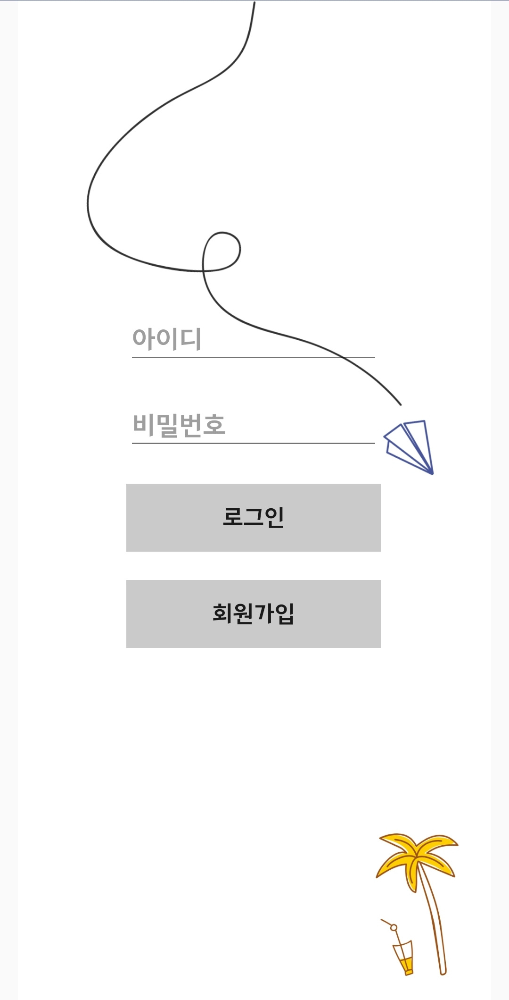
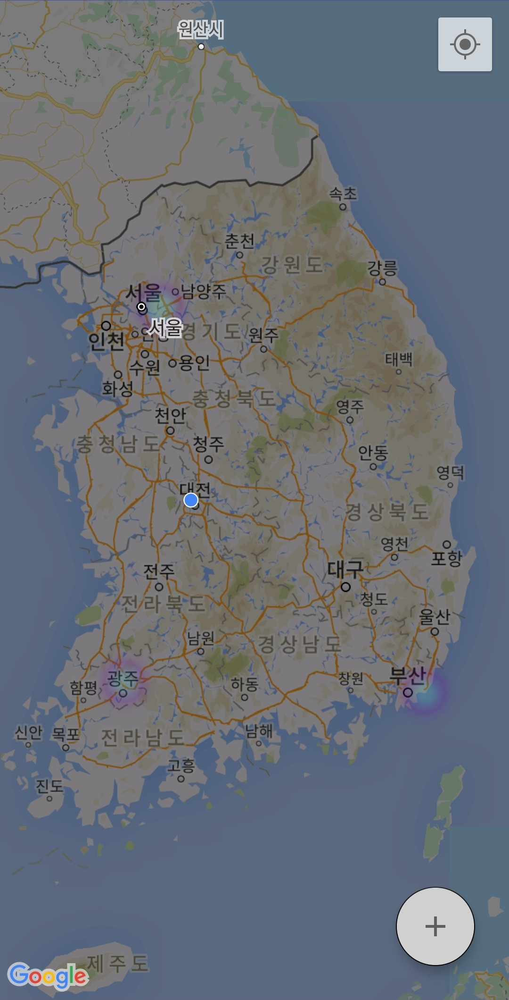
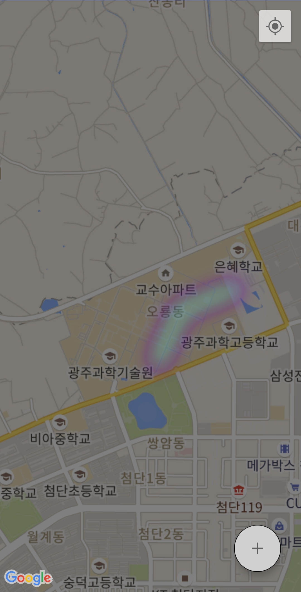
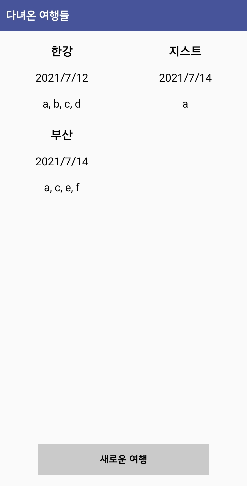
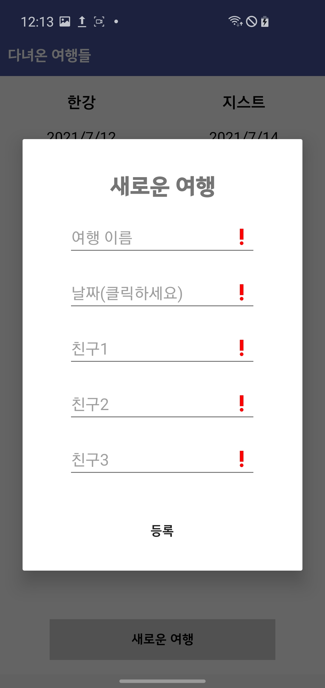
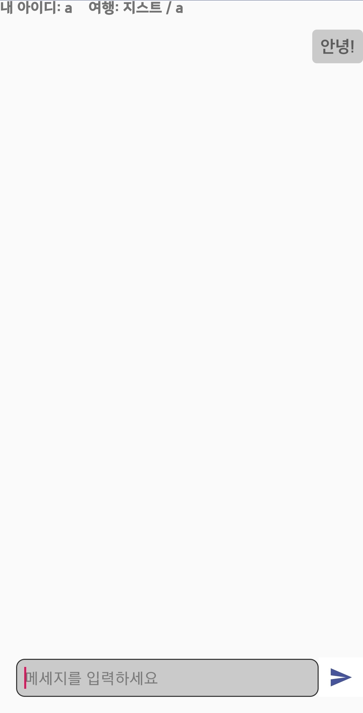

# 여행 SNS, "갔던"
--------------------------------------------

## 조원
김윤재, 박준영

--------------------------------------------

## Summary

> ### 여행을 기록하고, 공유하며, 함께 여행을 간 친구들과 소통할 수 있는 여행 SNS  
+ Frontend: Android studio에서 Java언어로 개발  
+ Backend: VScode에서 Javascript언어로 개발. NodeJS, Socket.io, MongoDB를 이용함  

--------------------------------------------

## Environment

* Android Studio 4.2.1
* CompileSdkVersion 30
* Language : JAVA

--------------------------------------------

## 로그인/회원가입
{: width="30%" height="30%"}
>  Backend
   + MongoDB에 Login collection을 만듬.
   + 회원가입 시 Login collection에 id, password, name을 저장함. 이때, id는 DB에 존재하는 id들과 중복되지 않아야 함.  
   + 로그인 시 해당하는 id와 password를 검색해 존재한다면 로그인이 가능하도록 함.

## 메인 화면
{: width="30%" height="30%"} {: width="30%" height="30%"}
>  Frontend
   + Google Map API
   + HeatMap  

>  Backend
   + 사용자가 지금까지 간 모든 여행들을 MongoDB의 Travel collection에서 검색하여 여행 경로들을 받아옴.  
 + 기능  
   + 지금까지 간 모든 여행들을 볼 수 있음.  
   + Floating button을 통하여 자신의 여행들, 공유된 여행들로 이동할 수 있음.  

## 자신의 여행들 / 공유된 여행들
{: width="30%" height="30%"} {: width="30%" height="30%"}
>  Frontend 
   + Gridview를 이용하여 여행 이름, 여행 날짜, 여행을 간 사람들의 아이디들을 보여줌.
   + Google Map API HeatMap을 이용함.  
>  Backend
   + MongoDb에서 Travel collection을 만듬.
   + Travel collection에는 여행 이름, 여행 날짜, 여행을 간 사람들, 공유 여부, 좋아요 개수, 좋아요를 누른 사람들, 여행 좌표, 여행 경로가 저장됨.  
>  기능  
   + 여행을 추가, 수정, 삭제할 수 있음.
   + 여행을 공유하고, 좋아요를 표시할 수 있음.
   + 여행 경로를 지도 위에 표시할 수 있음.
   + 지도 위에 마커를 표시할 수 있음.

>  여행 추가
{: width="30%" height="30%"}
>   + 새로운 여행을 추가 시 Travel collection에 여행 이름, 여행 날짜, 여행에 참가한 사람들의 아이디를 저장하도록 함.
>   + 이때, 여행 이름과 여행 날짜는 반드시 입력해야 하며, 친구들의 아이디는 DB에 존재하는 아이디이어야 함.
> 
>  여행 수정
>   + 여행을 수정 시 사용자가 전에 입력했던 정보를 띄워주며 원하는 정보를 수정할 수 있도록 함.
>   + DB의 collection도 수정된 정보를 update시켜줌.
> 
>  여행 삭제
>   + 여행을 삭제 시 DB의 collection에서 해당 document를 삭제함.
> 
>  여행 공유 & 좋아요
>   + 공유한 여행은 해당 여행을 함께 간 사람들 뿐 아니라 앱을 사용하는 모든 사람들이 볼 수 있음.
>   + 공유한 여행들에는 좋아요를 눌러 호응할 수 있으며, 한 여행 당 최대 1번 누를 수 있음.
>   + 공유된 여행은 좋아요 순, 최신 순 2가지로 정렬해 볼 수 있음.
> 
>  여행 경로 표시
> 
>  마커 표시

## 채팅
{: width="30%" height="30%"}
>  Frontend
   + RecyclerView를 이용하여 채팅들을 화면에 띄움.
>  Backend
   + Socket.io의 room 기능을 이용함.
   + MongoDB에 Chat collection을 만듬.
   + Chat collection에는 채팅방 이름, 채팅을 보낸 순서대로 아이디들과 메세지들이 저장됨.
